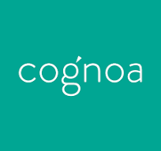

# Cognoa, Inc.

## Overview and Origin

Cognoa, Inc. is a pediatric behavioral health company headquartered in Palo Alto, California, operating primarily in the healthcare and artificial intelligence industries. Founded in 2013 by **Dennis Wall** and **Brent Vaughan**, the company aims to improve the early diagnosis and treatment of behavioral health conditions, particularly autism. The idea for Cognoa emerged from Dennis Wall's experiences in autism research, recognizing the need for better diagnostic tools to assist families facing developmental disorders. With a focus on leveraging AI technology, Cognoa has successfully developed its flagship product, **Canvas Dx**, an FDA-authorized diagnostic tool used by healthcare providers to diagnose or rule out autism in children aged 1.5 to 6 years.

Cognoa has received a total of **$125 million** in funding from three investors, enabling it to advance its mission of enhancing the lives and outcomes of children and families living with behavioral conditions. The current CEO, **Sharief Taraman, MD**, along with the founding team, continues to drive innovation within the company, making significant strides in addressing the challenges of timely and accurate diagnosis in the pediatric behavioral health space.

## Business Activities

Cognoa is addressing the challenges of timely and accurate diagnosis and treatment of behavioral health conditions, particularly autism, by developing digital diagnostics and therapeutics. The intended customers include pediatric patients, their families, and healthcare providers specializing in behavioral health. The global autism spectrum disorder therapeutics market is expected to reach approximately **$7.75 billion by 2030**, growing at a CAGR of **7.9%** from 2022 to 2030, indicating a substantial and expanding market for Cognoa's offerings.

Cognoa’s AI technology platform allows for earlier diagnosis and treatment options, focusing on unmet needs in behavioral health conditions such as ADHD and anxiety. This proactive approach sets it apart from traditional methods that may delay diagnosis and intervention. The company is utilizing AI and machine learning algorithms to analyze data and create digital diagnostic tools, significantly enhancing the accuracy and efficiency of behavioral health assessments.

## Landscape

Cognoa operates primarily in the healthcare and artificial intelligence industries, specifically focusing on behavioral health and diagnostic tools for autism and developmental disorders. Over the last decade, there has been a growing emphasis on early diagnosis and intervention for behavioral health conditions, driven by advancements in AI technology. The development of digital health solutions and telehealth services has increased access to care for families. **Competitors** include **Pliant Therapeutics**, **Inovio Pharmaceuticals**, and **Excision BioTherapeutics**, which are also working on innovative solutions in the healthcare sector.

## Results

Cognoa has made significant strides in the behavioral health space, with over **10,000 healthcare providers** utilizing their diagnostic tools. Their products have received positive feedback from users, demonstrating improvements in the efficiency of autism diagnosis and treatment planning. Core metrics used to measure success in this field include the number of diagnoses made using Canvas Dx, user satisfaction ratings, clinical validation outcomes, and revenue growth, which has been reported at approximately **20% annually** (source: [Crunchbase - Cognoa](https://www.crunchbase.com/organization/cognoa)). Cognoa is positioned favorably among competitors, with a unique focus on AI-driven diagnostics that streamline the process for providers and families.

## Recommendations

If you were to advise the company, expanding its product line to include telehealth services that provide remote consultations and follow-up assessments for families could be beneficial. Offering telehealth services would allow Cognoa to tap into a growing market for remote healthcare solutions, enhancing accessibility and convenience for users. This service would utilize video conferencing technology, secure data management systems, and AI for symptom assessment and treatment recommendations, ensuring seamless communication between healthcare providers and families while maintaining privacy and compliance with healthcare regulations.

## AI Domain Trends

The AI domain related to behavioral health has seen significant advancements over the past decade. Key trends include the integration of machine learning algorithms for data analysis, increased emphasis on early diagnosis, and the development of digital health solutions that facilitate remote care. Companies are focusing on personalized treatment plans powered by AI, which enhance the overall effectiveness of behavioral health interventions. The adoption of telehealth has accelerated, particularly in response to the COVID-19 pandemic, making it essential for companies like Cognoa to adapt to new healthcare delivery models (source: [Market Research Report](https://www.cognitivemarketresearch.com/autism-disorder-and-treatment-market-report?campaign_name=cmr_dsa_optimized&campaign_source=google_ads&campaign_name=us_pmax_dynamic&gad_source=1&gclid=Cj0KCQjwq_G1BhCSARIsACc7Nxoc_6kaqf4Ju4Q3HyFabJPq9jDYDK7kg9DuvDqc7xLzSd14M4TzQioaAqtLEALw_wcB) and [Scientific American](https://www.scientificamerican.com/article/meet-the-bad-boy-of-autism-research/)).

## Sources for Verification

1. **Cognoa Official Website:** [Cognoa About Us](https://cognoa.com/about-us/)
2. **Scientific American:** [Meet the Bad Boy of Autism Research](https://www.scientificamerican.com/article/meet-the-bad-boy-of-autism-research/)
3. **Crunchbase:** [Crunchbase - Cognoa](https://www.crunchbase.com/organization/cognoa)
4. **Biofuture:** [Brent Vaughan Biography](https://biofuture.com/brent-vaughan/)
5. **Crunchbase:** [Brent Vaughan Profile](https://www.crunchbase.com/person/brent-vaughan/)
6. **Market Research Report:** [Autism Disorder and Treatment Market Report](https://www.cognitivemarketresearch.com/autism-disorder-and-treatment-market-report?campaign_name=cmr_dsa_optimized&campaign_source=google_ads&campaign_name=us_pmax_dynamic&gad_source=1&gclid=Cj0KCQjwq_G1BhCSARIsACc7Nxoc_6kaqf4Ju4Q3HyFabJPq9jDYDK7kg9DuvDqc7xLzSd14M4TzQioaAqtLEALw_wcB)

